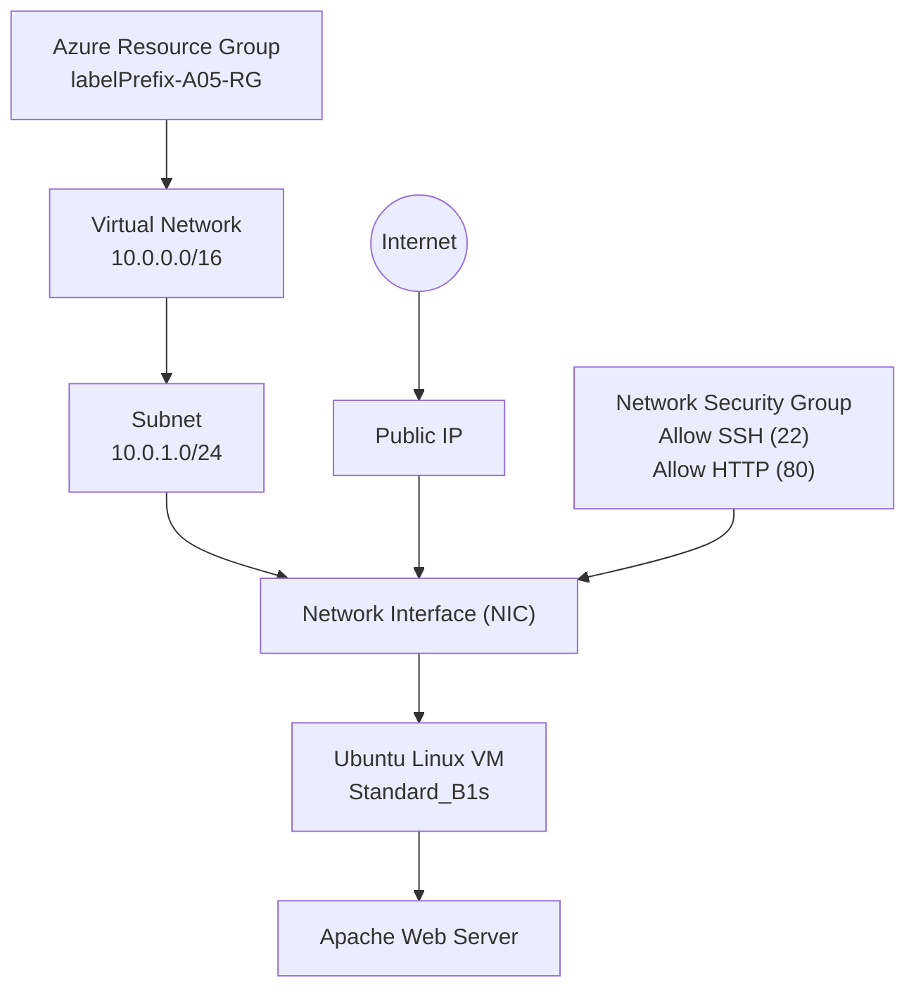

```mermaid
flowchart TD

    Internet((Internet))

    RG["Azure Resource Group<br/>labelPrefix-A05-RG"]

    VNET["Virtual Network<br/>10.0.0.0/16"]

    SUBNET["Subnet<br/>10.0.1.0/24"]

    PIP["Public IP"]

    NIC["Network Interface (NIC)"]

    NSG["Network Security Group<br/>Allow SSH (22)<br/>Allow HTTP (80)"]

    VM["Ubuntu Linux VM<br/>Standard_B1s"]

    Apache["Apache Web Server"]

    Internet --> PIP
    RG --> VNET
    VNET --> SUBNET

    SUBNET --> NIC
    PIP --> NIC
    NSG --> NIC

    NIC --> VM
    VM --> Apache
```
